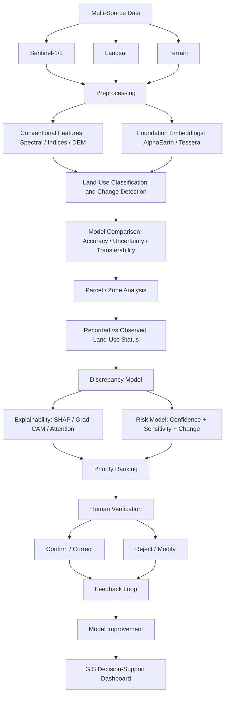

# Explainable parcel-level discrepancy detection
### Explainable GeoAI for Parcel-Level Land-Use Verification and Discrepancy Detection: Integrating Multi-Temporal Earth Observation and Cadastral Data in the Aravalli Range

---

## About the Research

Land-use change, unauthorized development, encroachment, mining expansion and conversion of environmentally sensitive land are major challenges for effective land governance.

Conventional land monitoring relies heavily on field inspections, cadastral records and periodic surveys. These approaches can be time-consuming, spatially limited and difficult to scale across large and heterogeneous landscapes.

This PhD proposes an Explainable GeoAI framework that integrates multi-temporal Earth observation, cadastral/land-record information, geospatial embeddings and explainable artificial intelligence to identify and explain potential land-use inconsistencies at the parcel level.

The Aravalli Range will serve as the primary case study because of its complex interaction of urbanization, mining, agriculture, infrastructure development and ecological degradation.

The objective is not to automatically declare land as "illegal." Instead, the framework will generate evidence-based alerts and prioritization for human-led verification and enforcement support.

---

## Problem Statement

Current land-use monitoring faces several challenges:

- Land records and remotely sensed observations are often maintained separately.
- Conventional land surveys are expensive and time-consuming.
- Satellite-based LULC studies commonly operate at pixel or image level rather than parcel level.
- Existing AI models may detect changes without explaining why a location was flagged.
- Land-use changes can occur gradually and may be difficult to identify through single-date imagery.
- Different types of land pressure such as urbanization, mining and vegetation loss require integrated monitoring.
- Models trained in one geographic region may not generalize well to another region.

Therefore, there is a need for a parcel-level, multi-temporal and explainable GeoAI framework capable of connecting observed land-use changes with available land-record information.

This research proposes an Explainable GeoAI framework capable of automatically comparing recorded land use against multi-temporal satellite observation at the parcel level, generating explained, risk-prioritized alerts for human-led verification — rather than a manual, landscape-wide search for inconsistencies.

---

## Proposed Solution

The proposed system draws on multi-temporal satellite imagery (Sentinel-1, Sentinel-2, Landsat) and geospatial foundation-model embeddings (e.g., AlphaEarth, Tessera) to observe land parcels at regular revisit intervals.

Each observation is processed using deep learning-based classification and change-detection models to identify land-use transitions — such as vegetation loss, built-up expansion, or mining-surface growth — at the parcel or zone level.

Detected changes are combined with parcel boundaries, cadastral land-record status, and observation timestamps to generate:

- Land-Use Consistency Score (recorded use vs. observed use)
- Change Confidence Score (model certainty in the detected transition)
- Environmental Sensitivity Score (proximity to forest, protected, or ecologically fragile land)
- Encroachment Risk Score (likelihood the change is inconsistent with permitted use)
- Verification Priority Score (ranking for human review, weighted by risk and confidence)

Each score is accompanied by an explainability output stating why the parcel was flagged, so reviewing officials see the evidence, not just a number.

The processed information is displayed on a GIS-enabled dashboard to assist revenue and enforcement authorities in prioritizing field verification and allocating limited inspection capacity to the highest-risk parcels first.

---

## Research Objectives

1. To construct a multi-source, multi-temporal geospatial database for a defined Aravalli pilot region, integrating Sentinel-1/2, Landsat, terrain derivatives, and available cadastral/land-record data, with explicit documentation of coverage gaps and data-quality limitations across administrative boundaries.

2. To develop a foundation-embedding-based representation (using pretrained spatiotemporal embeddings such as AlphaEarth/Tessera) for land-use characterisation, and to benchmark this representation against classical machine learning (Random Forest, XGBoost) and deep learning baselines (CNN, U-Net, transformer-based architectures) for land-use classification and change detection, evaluated at the spatial resolution the underlying data can actually support.

3. To develop explainable GeoAI methods (SHAP, Grad-CAM, attention-based and counterfactual techniques) that attribute each flagged land-use discrepancy to interpretable evidence, evaluated not only for technical fidelity but for usability by non-technical reviewing officials.

4. To integrate cadastral/land-record information with remotely sensed observations into a parcel- or zone-level verification workflow that compares recorded and observed land use and quantifies the discrepancy.

5. To design a risk-prioritisation framework that ranks flagged parcels for human review, incorporating change confidence, environmental sensitivity, and land-use type, rather than presenting flags as undifferentiated output.

6. To design and pilot a human-in-the-loop verification workflow, defining how flags are reviewed, confirmed, corrected, or dismissed, and how reviewer feedback is captured to improve the system over time.


---

## Novelty

The proposed research seeks to advance existing GeoAI-based land monitoring by integrating explainable change detection with parcel-level land-record verification, risk-based prioritisation, and human-in-the-loop validation within a unified framework. The novelty lies in developing an integrated, explainable and parcel-aware GeoAI framework for identifying and prioritising land-use discrepancies in heterogeneous Aravalli landscapes.

**1. Foundation-embedding-based land characterisation**
Rather than relying solely on hand-engineered spectral indices or task-specific deep networks trained from scratch, the framework builds land-use representation on pretrained spatiotemporal geospatial embeddings (e.g., AlphaEarth, Tessera-derived), benchmarked against classical and deep-learning baselines to establish where embedding-based representation offers a genuine advantage for parcel-scale monitoring in a data-heterogeneous landscape like the Aravalli range.

**2. Explainable GeoAI for evidence-based flagging**
Rather than producing only change or classification labels, the framework will associate detected discrepancies with interpretable spatial, spectral, temporal, and contextual evidence.

**3. Risk-based prioritisation over undifferentiated detection**
Detected discrepancies will be ranked using a composite of change confidence, environmental sensitivity, and land-use type, directing limited verification capacity toward the highest-risk parcels first — rather than presenting all detected changes as equally actionable.

**4. Feasibility-grounded integration across heterogeneous data conditions**
Unlike frameworks that assume uniform, high-quality cadastral coverage, this research explicitly documents and works within the coverage gaps and resolution constraints that exist across the Aravalli Range's multiple administrative jurisdictions, making the framework's outputs honestly bounded rather than overstated.

**5. Human-in-the-loop verification as a designed workflow, not an afterthought**
The framework treats model output as the starting point for review, correction, and feedback by reviewing authorities, with an explicit workflow for confirming, dismissing, or appealing flags — positioning the system as decision-support rather than automated determination.

**6. Parcel-aware land-use discrepancy assessment**
The framework will link remotely sensed observations with available cadastral and land-record information to evaluate discrepancies between recorded land-use status and observed land-surface conditions at parcel or management-zone level, rather than treating land-use change solely as a pixel-level classification problem.

---

## Proposed Workflow



## Data Sources Planned

- **Optical:** Sentinel-2, Landsat
- **SAR:** Sentinel-1
- **Foundation-model embeddings:** AlphaEarth Foundations, Tessera
- **Terrain:** DEM, slope, elevation derivatives
- **Land information:** Cadastral parcels and available land-use records (state Bhu-Naksha/Bhulekh portals, subject to access confirmation)
- **High-resolution imagery** (for parcel-level verification): Cartosat-3, PlanetScope, or state orthophotos where available

---

## Technologies Planned

**Programming:** Python

**Geospatial / Earth Observation:** Google Earth Engine, QGIS, GDAL, Rasterio

**Machine Learning / Deep Learning:** Random Forest, XGBoost, CNN, U-Net, transformer-based spatiotemporal models (PyTorch)

**Explainable AI:** SHAP, Grad-CAM, attention-based methods, counterfactual analysis

**Backend:** FastAPI

**Database:** PostgreSQL / PostGIS

**Visualization:** Leaflet, GIS dashboard

**Supporting libraries:** NumPy, Pandas, Matplotlib, Scikit-learn

---

## Repository Structure

```
explainable-geoai-land-governance/
│
├── data/
│   ├── satellite/
│   ├── cadastral/
│   └── terrain/
├── preprocessing/
├── embeddings/
├── models/
│   ├── classification/
│   └── change_detection/
├── explainability/
├── verification/
├── scoring/
├── dashboard/
├── backend/
├── notebooks/
├── docs/
├── outputs/
├── requirements.txt
└── README.md
```

---

## Implementation Plan

**Phase 1 — Literature Review & Data Feasibility (Year 1)**
Literature survey; identification of cadastral data access routes; resolution-strategy finalization; pilot sub-region selection.

**Phase 2 — Geospatial Database Development (Year 1)**
Integration of optical, SAR, terrain, and available cadastral data for the pilot region; documentation of coverage gaps.

**Phase 3 — Baseline Land-Use & Change Detection (Year 2)**
Development and benchmarking of classification/change-detection models at validated resolution.

**Phase 4 — Explainable GeoAI (Year 3)**
Development of SHAP/Grad-CAM/attention-based explanation methods for flagged discrepancies.

**Phase 5 — Land-Record Integration & Verification Workflow (Year 4)**
Integration of cadastral data with EO outputs; design of the human-in-the-loop review and appeals process.

**Phase 6 — Integration, Field Validation & Thesis Write-Up (Year 5)**
Field/expert validation of flagged parcels; framework consolidation; thesis.

*(Secondary, time-permitting: geospatial embedding transferability study — Year 3.)*

---

## Evaluation Metrics

**Model Performance**
- Precision, Recall, F1-score (per land-use transition class)
- Confusion matrix across land-use categories

**Explainability**
- Qualitative evidence-usefulness assessment by reviewing officials
- Consistency of explanations across similar cases

**Verification Workflow**
- Agreement rate between model flags and field/expert verification outcomes
- False-positive / false-negative rate on flagged parcels

**Transferability (secondary)**
- Cross-region performance drop when applying a model trained in one sub-region to another

---

## Current Status

- [x] Research topic 
- [x] Literature review — in progress
- [ ] Pilot sub-region selection
- [ ] Cadastral data-access request
- [ ] Geospatial database construction
- [ ] Baseline model development
- [ ] Explainability module development
- [ ] Land-record verification workflow design
- [ ] Field/expert validation
- [ ] Thesis write-up

---

## Researcher

**Neetu**
PhD Researcher, RCGSIDM, IIT Kharagpur
Supervisor: Prof. Bharath H. Aithal

---

## Note

This repository is under active development as part of ongoing PhD research. The framework, datasets, and documentation will be updated as data-access agreements, pilot-region selection, and methodology are finalized with the supervising committee.
   
